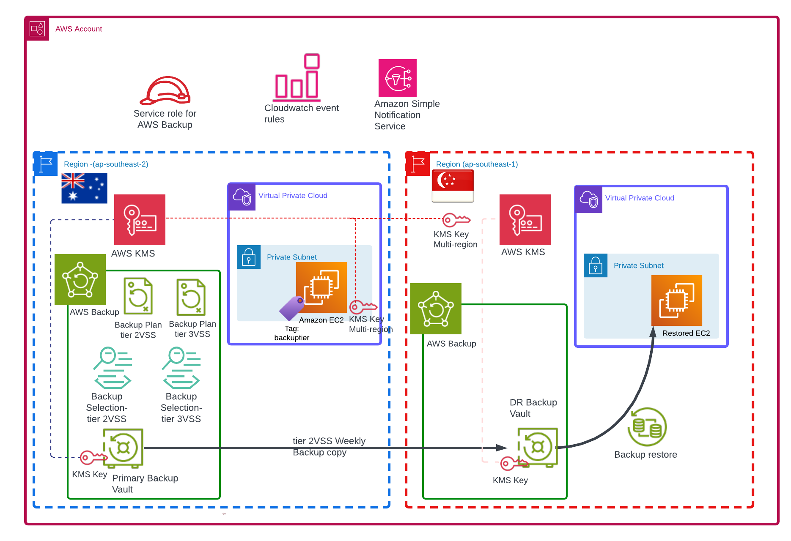

# Overview  

Please see blog site hhttps://devbuildit.com/2023/03/25/windows-ec2-backups-part-2/ for detailed explaination of this repo contents.

This repo (and associated blogs) will help you create an environment for AWS Backup and create an instance for backup and restore tesing.

## Requirements:
- AWS Account
- Terraform CLI installed with access to your target AWS account (via temporary Indentity centre credentials or AWS IAM access keys)

## Deployment
- Clone repo into a source folder
- Update file terraform.tfvars to suit your environment
- Run command 'Terraform init' in source folder
- Run command 'Terraform plan' in source folder
- Run command 'Terraform apply' in source folder and approve apply

